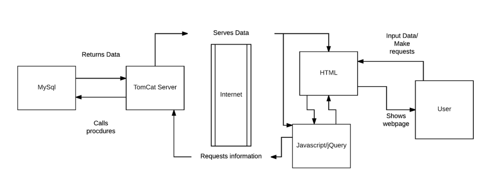
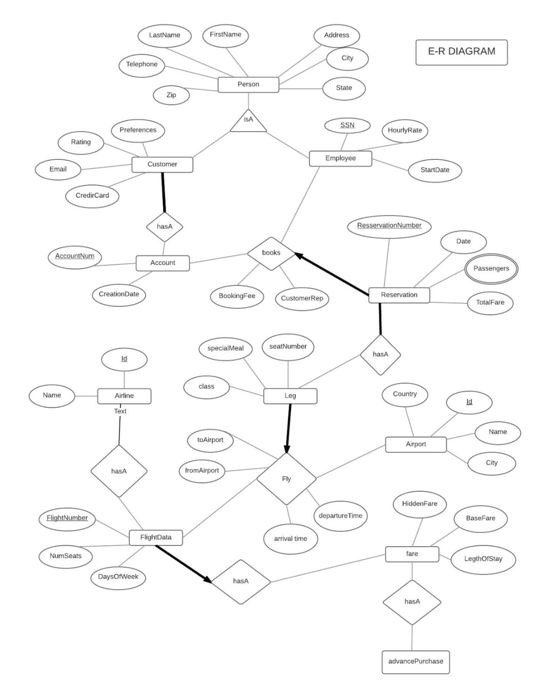

# flight booking system
### Team Project (Kyeongsoo Kim, Muhammad Islam, and John Martin.) August 2017 ~ December 2017
## 1.Introduction
We have designed and implemented a relational database system to support the operations of an online travel reservation system, such as Skyscanner, Expedia, and etc. We aimed to have full functionality and features of online travel reservation system, considering client’s side, and manager’s side. The basic idea behind this system is that it allows customers to use the web to browse and search the contents of the database and make flight reservations on the website as well as it allows users to query the database for available flights. The systems provides many functionality that is provided in general travel reservation website. Especially, like Reverse auction sites such as Priceline and Expedia, it supports special function(reverse auctions), in which individuals specify the price they are willing to pay for a seat and the airlines either agree to sell it at that price or not. 

## 2. Collaboration Plan
Our team(Triptopia) consists of 3 members(Kyeongsoo Kim, Muhammad Islam, and John Martin.) Muhammad Islam worked on ER diagram design and focused on overall back end side. Kyeongsoo Kim worked on E-R diagram and focused on front end design and Customer side back end. Lastly, John Martin worked on Relational model, and focused on front end and connectivity between user interface and database server.

## 3. User interface & Database server information
When it comes to programming language, framework and library, we used HTML/CSS, Jquery and bootstrap for the user interface. In server side, we used Tomcat and MySQL. For connectivity between website and the server, Java, JDBC, Javascript, Spring, and Maven is used. 

## 4. Architectural diagram of the whole system

## 5. E-R diagram

## 6. SQL code for Relational Model & Integrity constraints
[Click here](https://docs.google.com/document/d/1UjFRVbAqo0FVsSCqzy_RnfwY2Lss_6c869Vfr5Tkc9E/edit)

## 7. SQL code for transaction.
[Click here](https://docs.google.com/document/d/1pgCdt1u5C4iEhEGzBpYeJT2287er8EniSpsjl6CWhi4/edit)